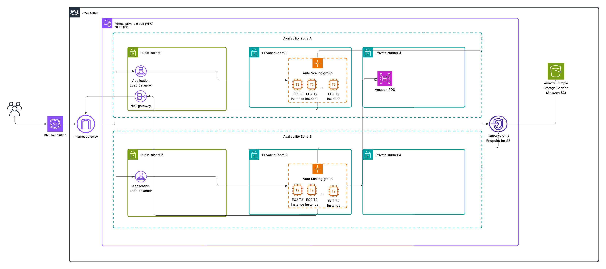

# Secure Multi-Tier Microservices App on AWS

This project deploys a **secure, highly available, and scalable multi-tier architecture** on AWS using **Terraform**. It simulates a production-grade environment for a Flask-based backend service integrated with Amazon RDS and S3. This serves as a capstone for the **AWS Certified Solutions Architect – Associate** certification.

---

## 🌐 Architecture Overview



### 🔐 Key Features

- **VPC** with public and private subnets across 2 Availability Zones
- **Application Load Balancer (ALB)** in public subnets
- **EC2 Auto Scaling Group (ASG)** for backend in private subnets
- **Amazon RDS (PostgreSQL)** in private, isolated subnets
- **Amazon S3 Gateway Endpoint** for private, secure object storage access
- **NAT Gateway** for secure outbound access from private subnets
- **Route 53** for DNS resolution
- **Infrastructure as Code** with modular, reusable Terraform

---

## 🚀 Deployment Instructions

### 📁 Pre-requisites

- Terraform >= 1.4
- AWS CLI
- AWS IAM user with sufficient permissions (VPC, EC2, RDS, S3, IAM, Route 53)

### 🔧 Setup

1. Clone the repo:
   ```bash
   git clone https://github.com/your-username/secure-architecture-capstone.git
   cd secure-architecture-capstone/terraform
   ```

2. Configure your variables by copying the example file:
   ```bash
   cp terraform.tfvars.example terraform.tfvars
   ```

3. Initialize and apply:
   ```bash
   terraform init
   terraform plan
   terraform apply
   ```

---

## 📦 Repo Structure

```
.
├── diagrams/
│   └── architecture.png
├── terraform/
│   ├── main.tf
│   ├── variables.tf
│   ├── outputs.tf
│   ├── backend.tf
│   └── terraform.tfvars.example
├── flask-backend/
│   ├── app.py
│   ├── Dockerfile
│   └── requirements.txt
├── README.md
└── LICENSE
```

---

## 🛡️ Security Considerations

- EC2 instances are in **private subnets** with no direct internet access
- ALB is the only public-facing component
- RDS is deployed in **isolated subnets** with no internet route
- NAT Gateway and S3 Gateway Endpoint allow controlled egress
- IAM roles follow **least privilege** principles

---

## 🧰 Technologies Used

- AWS VPC, EC2, ALB, RDS, S3, IAM, Route 53
- Terraform
- Flask (Python)
- Docker

---

## 🔮 Future Improvements

- Add CI/CD via GitHub Actions or CodePipeline
- Integrate AWS Secrets Manager for DB credentials
- Add WAF for ALB protection
- Include CloudWatch Alarms and Logging

---

## 📄 License

MIT License. See `LICENSE` file for details.
