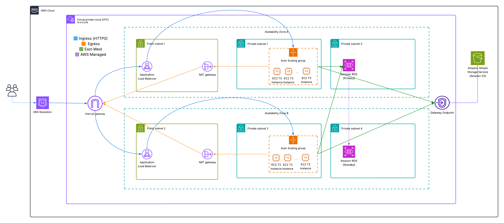

# Secure AWS Architecture Capstone



> ✅ **Status:** _Completed_  
> This project showcases a production-grade, secure AWS infrastructure built with Terraform. It follows best practices for scalability, modularity, and security, and serves as a portfolio-ready demonstration of cloud architecture design.

---

## 📘 Overview

This is a **fully reproducible, secure AWS infrastructure** built with **Terraform**, designed to highlight modern cloud architecture principles.  
The project demonstrates real-world skills in **infrastructure-as-code (IaC)**, **AWS networking**, and **secure service design**, with an emphasis on modularity and least privilege.

---

## ✅ Current Features

- 🏗️ **VPC** with public and private subnets across two Availability Zones  
- 🌐 **Internet Gateway** and **NAT Gateway** for controlled internet access  
- 🔐 **S3 Gateway VPC Endpoint** for secure private-subnet access to S3  
- ⚡ **Application Load Balancer** with HTTP→HTTPS redirect  
- 🔒 **AWS ACM Certificate** provisioning via Route 53 DNS validation  
- 🧱 **Security Groups** for ALB and EC2 isolation  
- 📁 **Modular Terraform** directory structure  

---

## 🔧 Services Used

- Amazon VPC  
- Amazon EC2  
- Application Load Balancer (ALB)  
- AWS Certificate Manager (ACM)  
- Amazon Route 53  
- Amazon S3  
- Amazon RDS  
- Auto Scaling  
- AWS Identity and Access Management (IAM)  

---

## 🧠 Goals

- Align with the **AWS Well-Architected Framework**  
- Build entirely using **infrastructure-as-code** (Terraform)  
- Design for **modularity**, **reusability**, and **scalability**  
- Enforce **security isolation** by subnet and IAM role  
- Deploy a **sample Flask application** and **RDS database** securely  

---

## 🧩 Next Phase

This project is **Part 1**, the foundational secure AWS architecture baseline.  
The next phase, **[Automated Cloud Security Operations & DevSecOps Capstone](https://github.com/Zach-Maestas/aws-security-ops-pipeline)**, builds on the same system and adds:

- **ECS Fargate deployment** replacing EC2 Auto Scaling, with task definitions, services, and ALB target groups using `ip` targets.
- **Secure CI/CD with GitHub Actions + OIDC**, including automated container build and push to ECR, and infrastructure deploy steps.
- **Secrets management upgrade**, moving DB credential retrieval out of application code and into **ECS task secrets injection** with least privilege IAM execution roles.
- **Security gates in CI**, including secret scanning and IaC scanning (and container scanning/SBOM as applicable).
- **Operations and security telemetry**, with CloudWatch logging and metrics, plus baseline detection (GuardDuty, Security Hub) and alert routing.
- **Incident response workflow**, with a small runbook and at least one automated response action wired to a detection.

## ❌ Known Limitations

- **Secrets retrieval pattern (v1)**: the Flask app retrieves DB secrets via boto3 at startup and mutates environment variables. In Part 2 this is replaced by **task-level secrets injection** and tighter IAM.
- **Terraform secret handling (v1)**: credentials are referenced via a Secrets Manager data source. In Part 2 secrets are **generated and managed by Terraform**, then consumed by ECS at runtime.
- **Frontend delivery (v1)**: static hosting is via S3 website endpoint without CloudFront. There were issues getting CORS working properly, and securely. In Part 2 the frontend is served through **CloudFront with TLS** and restricted bucket access.

---

## 📂 Project Structure

```shell
.
├── application/
│   ├── backend/
│   │   ├── app.py
│   │   └── requirements.txt
│   └── frontend/
│       ├── index.html
│       ├── styles.css
│       └── app.js
│
├── infrastructure/
│   ├── scripts/
│   │   └── user_data.sh
│   └── terraform/
│       ├── main.tf
│       ├── backend.tf
│       ├── outputs.tf
│       ├── providers.tf
│       ├── terraform.tfvars
│       ├── variables.tf
│       ├── versions.tf
│       ├── .terraform.lock.hcl
│       └── modules/
│           ├── network/
│           │   ├── main.tf
│           │   ├── variables.tf
│           │   └── outputs.tf
│           ├── app/
│           │   ├── data.tf
│           │   ├── main.tf
│           │   ├── variables.tf
│           │   ├── security_groups.tf
│           │   └── outputs.tf
│           ├── data/
│           │   ├── main.tf
│           │   ├── variables.tf
│           │   └── outputs.tf
│           ├── secrets/
│           │   ├── main.tf
│           │   ├── variables.tf
│           │   └── outputs.tf
│           └── acm/
│               ├── data.tf
│               ├── main.tf
│               ├── variables.tf
│               ├── security_groups.tf
│               └── outputs.tf
│
└── docs/
    ├── architecture.png
    ├── deployment.md
    ├── security.md
    └── demo.md
```
